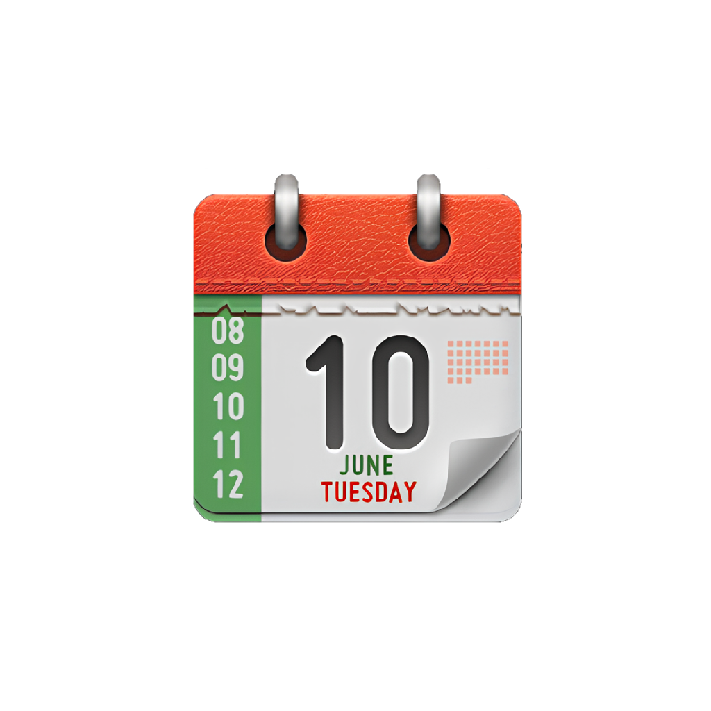
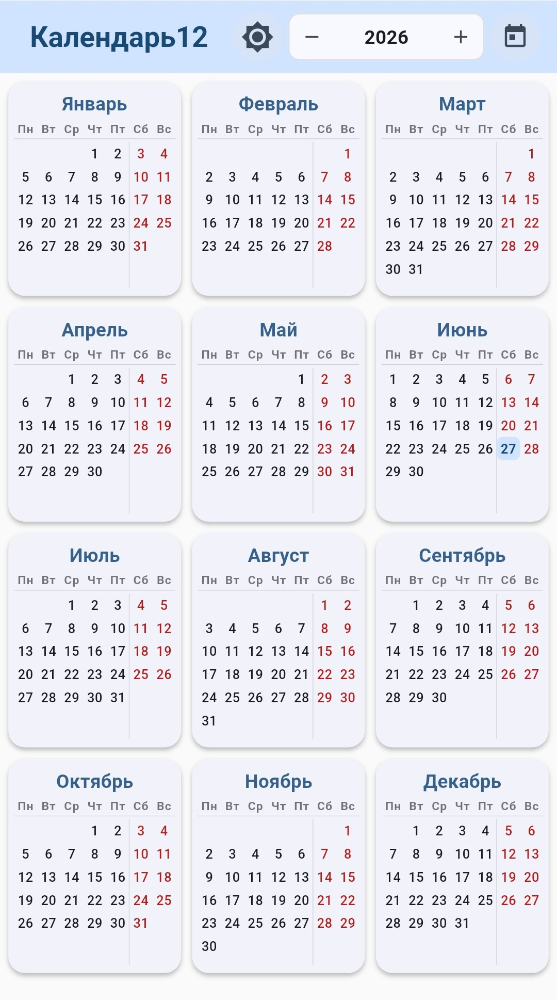
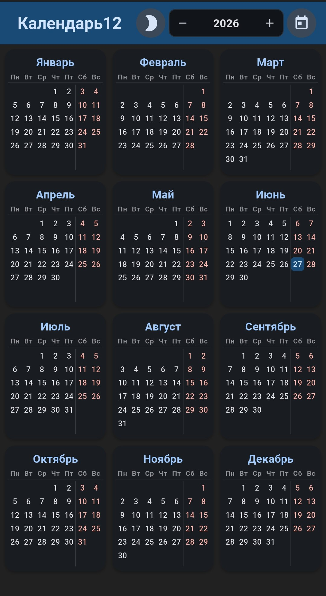

# 🗓️ Calendar12 (Календарь12)

  

  <strong>Красивый и удобный календарь на весь год — 12 месяцев на одном экране!</strong>

  
  
  
  
  

  

---

## 📖 О приложении

**Calendar12** — это современное Android-приложение, разработанное на Flutter, которое позволяет просматривать все 12 месяцев года на одном экране в виде удобной сетки 3×4. Приложение идеально подходит для быстрого планирования, просмотра дат и навигации по годам в широком диапазоне — от 1900 до 2070 года.

###  Ключевые особенности

-  **Все 12 месяцев на одном экране** — компактная сетка 3×4 для быстрого обзора всего года
- 🎨 **Три темы оформления** — светлая, тёмная и автоматическая (по системным настройкам)
- 💾 **Сохранение настроек** — выбранная тема запоминается между запусками
- 📆 **Широкий диапазон годов** — от 1900 до 2070 года
- 🔍 **Удобная навигация** — кнопки «−» и «+», выпадающий список и кнопка «Сегодня»
- 🎯 **Подсветка текущего дня** — сегодняшний день выделен цветом для быстрого нахождения
- 📱 **Адаптивный дизайн** — корректное отображение на любых экранах Android
- ⚡ **Быстрая работа** — локальная база данных Isar для мгновенного отклика
- 🌙 **Material Design 3** — современный и приятный интерфейс

---

## 📸 Скриншоты

  
  

>  *Скриншоты демонстрируют светлую и тёмную темы приложения*

---

## 🚀 Установка

### Требования
- Android 5.0+ (API 21)
- Flutter 3.27+
- Dart 3.5+

### Шаги установки
1. Клонируйте репозиторий: `git clone https://github.com/AdmiralMK/calendar12.git`
2. Перейдите в папку: `cd calendar12`
3. Установите зависимости: `flutter pub get`
4. Сгенерируйте код Isar: `dart run build_runner build -d`
5. Запустите: `flutter run`

---

## 📋 Планы развития

- Добавление заметок и событий к датам
- Экспорт календаря в PDF
- Виджет для рабочего стола Android
- Поддержка праздников разных стран
- Интеграция с Google Calendar
- Поддержка iOS и веб-версии

---

## 👨‍💻 Автор

- 📧 Email: kbmarkov@gmail.com
- 🐙 GitHub: [AdmiralMK](https://github.com/AdmiralMK)
- 📅 Год создания: 2026

---

##  Лицензия

Проект распространяется под лицензией MIT.

---

  Сделано с ❤️ и Flutter

